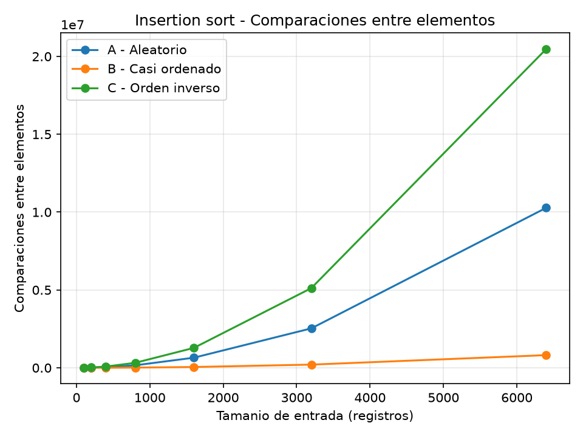
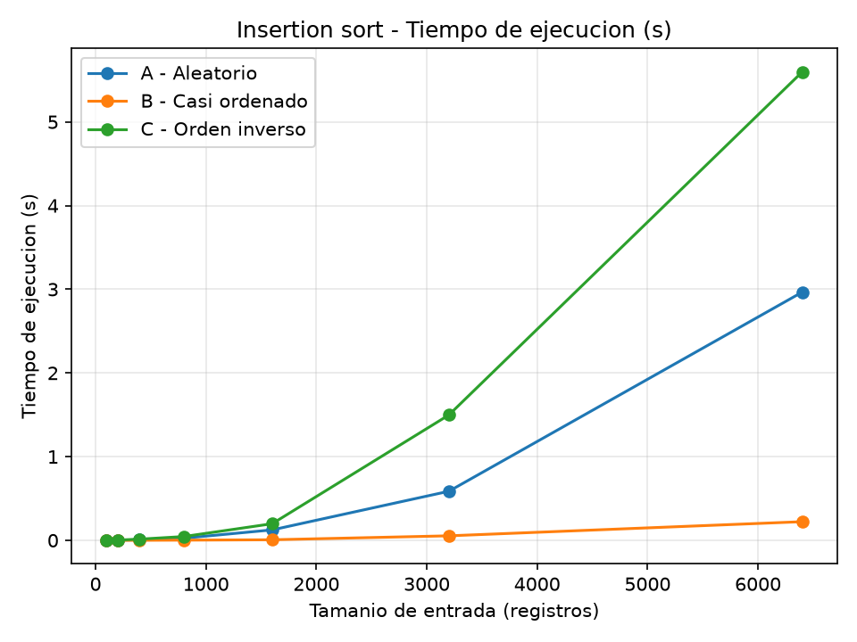
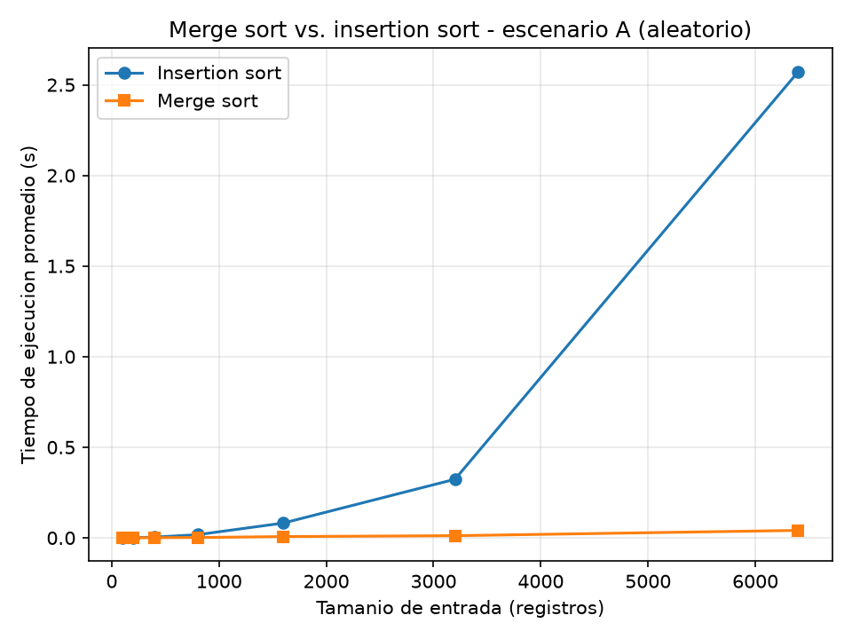

# Laboratorio evaluativo 01 — Fundamentos, complejidad y recurrencias

**Autor:** Juan José Rúa David
**Curso:** Análisis de Algoritmos
**Caso:** Plataforma Tamiza — Secretaría de Salud departamental

## Instrucciones para reproducir el experimento

1. Desde la raíz del repositorio, cree y active el entorno virtual e instale
   las dependencias (matplotlib queda registrado en `requirements.txt`):

   ```bash
   # Windows
   python -m venv venv
   venv\Scripts\activate
   pip install -r requirements.txt
   ```

2. Entre a la carpeta del laboratorio:

   ```bash
   cd lab1-fundamentos-complejidad-recurrencias
   ```

3. Ejecute la Parte 3 (insertion sort sobre los tres escenarios; genera
   `graficas/parte3_comparaciones.png` y `graficas/parte3_tiempo.png`):

   ```bash
   python parte3_casos.py
   ```

4. Ejecute la Parte 4 (comparación temporal entre algoritmos; genera
   `graficas/parte4_tiempo.png`):

   ```bash
   python parte4_complejidad.py
   ```

Cada medición se repite tres veces y se grafica el promedio, para reducir el
ruido del sistema operativo. Ningún script usa `sorted()` ni `list.sort()`:
los ordenamientos están implementados desde cero en `algoritmos.py`.

---

## Parte 1 — Analizar el algoritmo antes de comprar hardware

El argumento de infraestructura contiene una verdad parcial: el ordenamiento
que hoy corre en Tamiza es **correcto**. Correcto significa que, si se le da
tiempo suficiente, entrega la lista de llamadas con los 1.200.000 registros
ordenados de mayor a menor riesgo, y esa lista permite al centro de contacto
llamar primero a los pacientes más críticos. Ocho años de resultados correctos
lo confirman. Pero **correcto no es lo mismo que viable**. Un algoritmo es
viable para Tamiza cuando, además de ordenar bien, termina dentro de la
ventana de cuatro horas que va de las 2:00 a. m. a las 6:00 a. m. Esa es la
restricción concreta que el sistema incumple hoy: tres veces en las últimas
semanas el proceso no terminó antes de las 6:00 a. m. y el centro de contacto
trabajó con una lista parcial y mal ordenada. La corrección dice *qué* produce
el algoritmo; la viabilidad dice *cuándo* lo produce, y lo segundo no se
deduce de lo primero.

Duplicar la velocidad del servidor no ataca el problema de fondo. El tiempo de
un algoritmo depende de dos cosas: cuántas operaciones debe hacer y a qué
velocidad el hardware ejecuta cada una. Comprar una máquina del doble de
velocidad mejora lo segundo: divide el tiempo por dos, un factor constante.
Pero el número de operaciones de insertion sort crece con el cuadrado del
tamaño de la entrada: con n registros hace del orden de n²/2 comparaciones (en
mis mediciones de la Parte 3, 6.400 registros ya requieren 10.276.753
comparaciones). Duplicar el reloj convierte un proceso que tarda, por ejemplo,
unas 25 horas en uno que tarda 12,5, pero sigue muy por encima de las 4 horas,
y basta que el programa crezca un poco más para volver a desbordar. El
hardware multiplica por una constante; el orden de crecimiento del algoritmo
es lo que decide si el proceso cabe o no.

Un segundo ejemplo, distinto de Tamiza: en un curso anterior programé un
buscador que comparaba el término buscado contra cada uno de los ~30.000
registros de un catálogo, uno por uno, para encontrar coincidencias. El
resultado era correcto —encontraba todo lo que existía—, pero cada consulta
tardaba varios segundos y la interfaz se congelaba. La restricción que
incumplía era una latencia máxima de interacción (menos de unos 200 ms para
que la búsqueda se sintiera inmediata). Reorganizar el catálogo en una
estructura ordenada habría reducido el trabajo por consulta; cambiar el
computador por uno más rápido solo habría escondido el problema hasta que el
catálogo creciera.

---

## Parte 2 — Responsabilidad ambiental y ética de la implementación

Decidir qué algoritmo corre cada madrugada en Tamiza no es una decisión
puramente técnica: tiene consecuencias sobre el consumo de energía del Estado
y sobre la vida de personas concretas.

**Dimensión ambiental.** El proceso nocturno no es gratis. Mientras el
servidor ordena, la CPU trabaja, la memoria se recorre y el equipo consume
energía; el tiempo de ejecución es, en la práctica, una medida del trabajo
eléctrico realizado. Insertion sort sobre 1.200.000 registros ejecuta del
orden de cientos de miles de millones de comparaciones (mis mediciones
muestran que 6.400 registros ya exigen 10.276.753, y el número crece con el
cuadrado), frente a las decenas de millones que exigiría merge sort. Esa
diferencia no se paga una vez: el proceso corre *todas las madrugadas*, 365
días al año, durante los años que el sistema siga en producción. Un proceso
que ocupa el servidor varias horas cada noche mantiene la máquina en un estado
de consumo alto de forma acumulada; el mismo resultado, obtenido en segundos,
permite que el equipo quede libre y entre en reposo casi de inmediato.
Multiplicado por años, elegir el algoritmo equivocado es un gasto energético y
de emisiones que no produce ningún beneficio adicional: la lista final es la
misma.

**Dimensión ética.** La lentitud o el fallo del algoritmo no se reparte de
forma abstracta; golpea a personas identificables.

Primer perjuicio: un paciente de alto riesgo que queda fuera de la lista, o
muy abajo en ella, porque el proceso no terminó y el centro de contacto
trabajó con una lista parcial. Esa persona no recibe la llamada para su
valoración cardiovascular y su condición puede avanzar sin control. **Quién
asume el costo: el paciente**, con su salud; y en última instancia **la
Secretaría**, que es la responsable de garantizar la atención y responde por
la falla del servicio.

Segundo perjuicio: el operador del centro de contacto. Al recibir una lista
desordenada o incompleta, dedica su jornada a llamar en un orden que no
prioriza el riesgo real: gasta tiempo en casos leves mientras los críticos
esperan, trabaja bajo presión y con la carga emocional de saber que el orden
no es confiable. **Quién asume el costo: el operador** (desgaste, carga
laboral, responsabilidad de una decisión que no tomó) y, otra vez, **los
pacientes que no alcanzan a ser contactados**.

**La tensión del orden.** Hay una obligación adicional que va más allá del
tiempo: el orden de la lista decide *a quién se llama primero*, y quien es
llamado primero recibe atención antes. Eso convierte el ordenamiento en una
decisión con efecto clínico, no en un detalle de presentación. Si dos
pacientes tienen riesgos parecidos y el algoritmo los desempata de forma
arbitraria, el sistema está decidiendo, sin decirlo, quién tiene prioridad.
Por eso la corrección debe ser estricta y verificable, y conviene que el orden
sea estable y determinista: ante riesgos iguales, el resultado debe ser
siempre el mismo y auditable. Un error de ordenamiento aquí no es un dato
estadístico: es una persona que deja de ser atendida a tiempo. Esa
responsabilidad no la cubre ningún servidor más rápido.

---

## Parte 3 — Peor caso, mejor caso y caso promedio, demostrados en Python

Código de esta parte: [algoritmos.py](algoritmos.py), [datos.py](datos.py) y
[parte3_casos.py](parte3_casos.py).

### 3.1 — Explicación

**Definición de los tres casos.** Para los tres, el conjunto de entradas se
toma con un tamaño fijo n; lo que cambia es sobre qué se calcula el extremo o
el promedio.

- **Peor caso:** el **máximo** del tiempo (o del número de comparaciones)
  sobre *todas* las entradas de tamaño n. Es la entrada que obliga al
  algoritmo a hacer la mayor cantidad de trabajo posible. En insertion sort
  ordenando de mayor a menor es la lista que llega en orden inverso (de menor
  a mayor), porque cada elemento debe atravesar toda la parte ya ordenada.
- **Mejor caso:** el **mínimo** sobre todas las entradas de tamaño n. Es la
  entrada que permite terminar con el menor trabajo. En insertion sort es la
  lista que ya llega en el orden requerido: cada elemento se compara una vez
  contra el anterior y no se desplaza, así que hace exactamente n - 1
  comparaciones.
- **Caso promedio:** el **promedio** del trabajo sobre el conjunto de entradas
  de tamaño n (equivalentemente, sobre todas las permutaciones de n elementos
  distintas). No es una entrada particular: es el valor esperado si el lote
  llegara con un orden cualquiera.

**Qué caso usar para decidir si entra en producción.** El **peor caso**. La
ventana de cuatro horas es estricta y no negociable, y además el canal de
entrada puede cambiar sin aviso: no basta con que el día típico quepa. Un
algoritmo entra a producción solo si su peor caso cabe en la ventana; si se
decide con el caso promedio, cualquier madrugada con un lote en el orden
inverso —o con un crecimiento del programa— desborda.

**Predicción previa (escrita antes de medir).** Con insertion sort ordenando
de mayor a menor riesgo:

> - **Escenario A (aleatorio)** se aproxima al **caso promedio**: la lista
>   llega sin ningún orden y cada elemento se desplaza en promedio la mitad de
>   la parte ya ordenada.
> - **Escenario B (casi ordenado)** se aproxima al **mejor caso**: el 98 % ya
>   está en su lugar, así que cada elemento debería requerir pocas
>   comparaciones.
> - **Escenario C (orden inverso, de menor a mayor)** es el **peor caso**: la
>   lista llega exactamente al revés de lo que Tamiza necesita y cada elemento
>   debe atravesar todo lo ya ordenado.

### 3.2 — Demostración experimental

Se midió `insertion_sort` sobre los tres escenarios para los tamaños 100, 200,
400, 800, 1600, 3200 y 6400 registros, con `time.perf_counter()` y contando
las comparaciones entre elementos. Cada punto es el promedio de tres corridas.
El tiempo de generación de los datos no se cronometró: la medición cubre
únicamente la llamada al algoritmo.





**Resultados completos:**

| n | A comps | A tiempo | B comps | B tiempo | C comps | C tiempo |
|---|---|---|---|---|---|---|
| 100 | 2.542 | 0,43 ms | 294 | 0,05 ms | 4.950 | 0,80 ms |
| 200 | 9.970 | 1,54 ms | 983 | 0,17 ms | 19.900 | 3,18 ms |
| 400 | 40.436 | 7,37 ms | 3.541 | 0,59 ms | 79.800 | 14,37 ms |
| 800 | 160.484 | 25,95 ms | 13.392 | 2,30 ms | 319.600 | 45,43 ms |
| 1600 | 648.481 | 124,85 ms | 52.015 | 6,76 ms | 1.279.200 | 198,62 ms |
| 3200 | 2.533.103 | 586,20 ms | 204.939 | 54,04 ms | 5.118.400 | 1.497,63 ms |
| 6400 | 10.276.753 | 2.965,40 ms | 813.455 | 222,84 ms | 20.476.800 | 5.595,88 ms |

**Análisis.** El escenario **C** resultó el **peor caso**: sus comparaciones
siguen casi exactamente n²/2 (en n = 6400, 20.476.800) y su curva en la
gráfica crece de forma cuadrática, por encima de las otras dos. El escenario
**A** se aproxima al **caso promedio**: sus comparaciones quedan alrededor de
n²/4 (10.276.753 en n = 6400), justo la mitad del peor caso, y su curva crece
también de forma cuadrática pero por debajo de C. El escenario **B** es el
**mejor de los tres**: con 813.455 comparaciones en n = 6400 es unas doce
veces más barato que A y su curva se ve prácticamente plana frente a las
otras.

**Contraste con la predicción.** La predicción se cumple en lo esencial: C es
el peor caso, B el mejor y A el promedio. Hay un matiz que conviene señalar,
porque el experimento lo deja ver: B **no** es exactamente el mejor caso
teórico (Θ(n)), sino el escenario más cercano a él. La razón es que el 2 %
anexado al final está formado por los valores más grandes del lote, así que
cada uno de esos elementos debe recorrer todo el 98 % ya ordenado antes de
quedar en su lugar; su costo total es del orden de 0,02·n², un término
cuadrático con coeficiente muy pequeño. Por eso su curva, aunque la más baja,
también se empina al crecer n. El mejor caso puro (una lista ya ordenada)
daría n - 1 = 6.399 comparaciones, y no es lo que produce el escenario B.

---

## Parte 4 — Complejidad de merge sort e insertion sort: cálculo y validación

Código de esta parte: [parte4_complejidad.py](parte4_complejidad.py), que usa
[algoritmos.py](algoritmos.py) y [datos.py](datos.py).

### 4.1 — Cálculo teórico

#### Recurrencia de merge sort

Planteamiento:

```
T(n) = 2·T(n/2) + Θ(n)
```

De dónde sale cada término:

- **2 subproblemas (a = 2):** cada llamada parte el arreglo en dos mitades y
  ordena cada una por separado, así que genera dos llamadas recursivas.
- **Tamaño n/2 (b = 2):** cada mitad tiene la mitad de los elementos.
- **Θ(n) de combinar:** la mezcla de dos mitades ya ordenadas recorre, en el
  peor caso, los n elementos para unirlos (más el costo constante de partir).

Resolución por **método maestro**:

1. Identificar los ingredientes: a = 2, b = 2, f(n) = Θ(n).
2. Calcular n^(log_b a) = n^(log_2 2) = n¹ = n.
3. Comparar f(n) con n^(log_b a): f(n) = Θ(n) y n^(log_b a) = Θ(n), por lo
   tanto f(n) = Θ(n^(log_b a)).
4. Como f(n) = Θ(n^(log_b a)), aplica el **Caso 2** del método maestro.
5. Conclusión: T(n) = Θ(n^(log_b a) · log n) = **Θ(n log n)**.

#### Análisis línea a línea de insertion sort

La implementación (en [algoritmos.py](algoritmos.py)) con el costo c_j de cada
línea. Sea t_i el número de veces que se ejecuta el cuerpo del `while` para el
elemento i (i de 1 a n-1).

```python
def insertion_sort(datos):              # línea   costo   veces (peor)
    copia = list(datos)                 #  L1      c1      1
    comparaciones = 0                   #  L2      c2      1
    n = len(copia)                      #  L3      c3      1
    for i in range(1, n):               #  L4      c4      n
        clave = copia[i]                #  L5      c5      n-1
        j = i - 1                       #  L6      c6      n-1
        while j >= 0:                   #  L7      c7      Σ(t_i + 1)
            comparaciones += 1          #  L8      c8      Σ t_i
            if copia[j] >= clave:       #  L9      c9      Σ t_i
                break                   #  L10     c10     0
            copia[j + 1] = copia[j]     #  L11     c11     Σ t_i
            j -= 1                      #  L12     c12     Σ t_i
        copia[j + 1] = clave            #  L13     c13     n-1
```

Peor caso (lista en el orden inverso al requerido): para cada i la clave debe
llegar hasta el inicio, el `break` nunca se ejecuta y t_i = i. Entonces:

- Σ_{i=1}^{n-1} t_i = 1 + 2 + ... + (n-1) = n(n-1)/2.
- Σ_{i=1}^{n-1} (t_i + 1) = n(n-1)/2 + (n-1).

Sumando todas las líneas:

```
T(n) = c1 + c2 + c3 + c4·n + (c5 + c6 + c13)·(n-1)
     + c7·[n(n-1)/2 + (n-1)] + (c8 + c9 + c11 + c12)·n(n-1)/2
```

El término dominante es n(n-1)/2 multiplicado por constantes; por lo tanto, en
el peor caso **T(n) = Θ(n²)**.

En el mejor caso (lista ya ordenada de mayor a menor) cada elemento hace una
sola comparación y rompe el ciclo: Σ t_i = n - 1, y T(n) es lineal, **Θ(n)**.
En el caso promedio cada elemento se desplaza la mitad de la parte ya
ordenada, Σ t_i ≈ n²/4, y **T(n) = Θ(n²)**.

#### Tabla de complejidades esperadas (por caso)

| Algoritmo | Mejor caso | Caso promedio | Peor caso |
|---|---|---|---|
| Insertion sort | Θ(n) | Θ(n²) | Θ(n²) |
| Merge sort | Θ(n log n) | Θ(n log n) | Θ(n log n) |

### 4.2 — Validación experimental

Se midió el tiempo de `insertion_sort` y `merge_sort` sobre el escenario A
(aleatorio) de Tamiza, con los mismos tamaños de entrada de la Parte 3 y
`time.perf_counter()`. Cada punto es el promedio de tres corridas; el tiempo
de generación de los datos no se cronometró.



**Resultados destacados:**

| n | Insertion sort | Merge sort |
|---|---|---|
| 100 | 0,27 ms | 0,17 ms |
| 800 | 17,40 ms | 1,75 ms |
| 3200 | 323,23 ms | 11,83 ms |
| 6400 | 2.572,29 ms | 41,11 ms |

**Lectura de la gráfica.** Las dos curvas se separan desde el comienzo y la
brecha crece sin parar. La curva de insertion sort se empina: al duplicar n de
3200 a 6400 su tiempo pasa de 323 ms a 2.572 ms, es decir, se multiplica por
casi 8 (más que por 4), señal de un crecimiento cuadrático. La curva de merge
sort se mantiene mucho más plana: en ese mismo salto pasa de 11,83 ms a
41,11 ms, un factor cercano a 3,5, coherente con un crecimiento n log n. En
n = 6400 insertion sort tarda unas 63 veces más que merge sort (2.572 ms
frente a 41 ms).

**Contraste con la teoría.** La gráfica coincide con lo calculado en 4.1:
insertion sort crece de forma cuadrática y merge sort de forma n log n. En
los tamaños pequeños no aparece el cruce clásico en el que insertion sort
gana (para decenas de elementos, sus constantes son menores que las de la
recursión), porque ya desde n = 100 merge sort es más rápido en esta
implementación; lo importante es la tendencia, que se acentúa al crecer n.

**Conclusión.** Para Tamiza conviene **merge sort**, y la conclusión se lee en
la propia gráfica: su curva crece despacio y se aleja cada vez más de la de
insertion sort a medida que aumenta el tamaño de entrada.

### 4.3 — Concepto técnico a la Secretaría de Salud

**Para:** equipo de ingeniería, Secretaría de Salud departamental
**Asunto:** algoritmo de ordenamiento del proceso nocturno de Tamiza y
propuesta de ampliación de hardware

**Recomendación.** El proceso debe ejecutarse con **merge sort** como único
algoritmo en producción. El criterio para resolver el compromiso es el peor
caso: el canal de entrada de los lotes puede cambiar sin aviso (portal web,
reproceso del día anterior o migración del sistema legado), y mantener tres
implementaciones distintas —una por escenario— significa más código, más
pruebas y más superficie de error. Merge sort es el único de los dos
candidatos cuyo tiempo está garantizado en Θ(n log n) para los tres
escenarios; insertion sort solo es barato cuando el lote llega casi ordenado
(escenario B) y se degrada a Θ(n²) en A y C. Con una sola implementación de
merge sort se cubren los tres canales sin depender de que el flujo de datos
se mantenga igual.

**¿Cabe en la ventana de cuatro horas?** Es una *estimación* basada en la
forma de las curvas medidas, no una medición directa. Con n = 6.400 registros
del escenario A, insertion sort tardó 2,572 s y merge sort 0,041 s (gráfica
`graficas/parte4_tiempo.png`, promedio de tres corridas). Para pasar a
1.200.000 registros el factor de escala es k = 1.200.000 / 6.400 ≈ 187,5.

- **Insertion sort** es cuadrático: el tiempo se multiplica por k². Entonces
  2,572 s × 187,5² ≈ 90.400 s ≈ **25 horas**. No cabe, ni de lejos; en el
  escenario C sería peor todavía. Esto es coherente con los tres desbordes ya
  observados.
- **Merge sort** es n log n: el tiempo se multiplica por
  (N·log N)/(n·log n) = (1,2·10⁶ · 20,2)/(6.400 · 12,6) ≈ 300. Entonces
  0,041 s × 300 ≈ **12 segundos**. Cabe con un margen enorme.

La estimación supone que las constantes medidas se mantienen al crecer; aun
si el tiempo real fuera cien veces mayor, merge sort seguiría dentro de la
ventana de cuatro horas.

**Sobre la compra del servidor del doble de velocidad.** El dato medido
permite responder de forma directa. En la gráfica `graficas/parte4_tiempo.png`,
con n = 6.400 y escenario A, insertion sort tarda 2,572 s. Duplicar la
velocidad del reloj dividiría ese tiempo por dos, pero también dividiría por
dos las ~25 horas estimadas para 1.200.000 registros, dejándolas en ~12,5
horas: el proceso seguiría desbordando la ventana de cuatro horas y volvería a
desbordarla con el siguiente crecimiento del programa. El hardware mejora un
factor constante; el problema es el orden de crecimiento cuadrático. Invertir
en el servidor sin cambiar el algoritmo no resuelve la causa.

**Una consideración adicional: la memoria.** Merge sort no ordena en el lugar:
necesita espacio auxiliar O(n) para las listas que va mezclando, mientras
insertion sort trabaja con memoria O(1). Para 1.200.000 enteros el arreglo
auxiliar ronda los 10 MB, una cifra manejable en un servidor actual, pero debe
declararse y monitorearse, porque es un requisito que insertion sort no tenía.
A cambio, merge sort es un ordenamiento estable y determinista: ante dos
pacientes con el mismo índice de riesgo, el orden de salida no depende del
azar, lo cual importa cuando el orden decide a quién se llama primero. También
conviene vigilar el escenario B: hoy es la única ventaja de insertion sort,
pero si el flujo de reproceso cambia, esa ventaja desaparece; merge sort es
indiferente a ese cambio.
