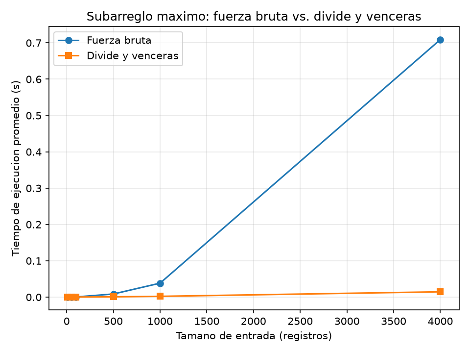

# Laboratorio evaluativo 02 — Dividir y vencer

**Autor:** Juan José Rúa David
**Curso:** Análisis de Algoritmos
**Caso:** Cooperativa de tiendas de barrio — mejor racha de variación de caja

## Instrucciones para reproducir el experimento

1. Desde la raíz del repositorio, active el entorno virtual e instale las
   dependencias (matplotlib queda registrado en `requirements.txt`):

   ```bash
   # Windows
   venv\Scripts\activate
   pip install -r requirements.txt
   ```

2. Entre a la carpeta del laboratorio:

   ```bash
   cd lab2-divide-y-vencer
   ```

3. Ejecute las pruebas de verificación:

   ```bash
   python pruebas.py
   ```

4. Ejecute la medición (genera `graficas/tiempo_vs_n.png`):

   ```bash
   python medicion.py
   ```

Cada medición se repite tres veces y se grafica la mediana, para reducir el
ruido del sistema operativo. Ningún script usa `max()` sobre sumas de
subarreglos ni librerías externas que resuelvan el problema: los algoritmos
están escritos desde cero en `subarreglo.py`.

---

## Parte 1 — Implementación y verificación

Código de esta parte: [subarreglo.py](subarreglo.py) y [pruebas.py](pruebas.py).

En `subarreglo.py` están las tres funciones pedidas: `subarreglo_fuerza_bruta`
resuelve el problema en Θ(n²) acumulando la suma dentro del ciclo interno;
`suma_cruzada` hace el barrido lineal desde el punto medio hacia la izquierda
(`medio` hacia atrás) y hacia la derecha (`medio + 1` hacia adelante); y
`subarreglo_maximo` resuelve los tres casos —izquierdo, derecho y cruzado— y
devuelve el mejor, sin llamar a la fuerza bruta. Ninguna función modifica la
lista recibida.

La verificación está en `pruebas.py`, como una serie de `assert` que cubre:

- La serie de ocho días de la situación problema, cuya mejor racha suma 17
  (se verifica además que los índices devueltos sumen ese valor).
- Una serie de un solo elemento (positivo y negativo).
- Una serie con todos los valores negativos.
- Una serie con todos los valores positivos.
- Un caso cuyo mejor tramo cruza el punto medio (`[-5, 4, 3, -5]`, suma 7).
- Veinte listas aleatorias con semilla fija, en las que ambas funciones deben
  devolver la misma suma.

Las pruebas comparan la suma, no los índices, porque ante empates cualquiera
de los tramos es válido.

---

## Parte 2 — Medición y gráfica

Código de esta parte: [medicion.py](medicion.py).

La gráfica compara el tiempo de ejecución de ambos algoritmos frente al tamaño
de entrada, con la misma serie aleatoria (semilla fija 2026, enteros entre -100
y 100) para los dos en cada tamaño. Solo se cronometra la llamada al algoritmo
con `time.perf_counter()`, nunca la generación de los datos. Cada punto es la
mediana de tres corridas y, dentro del propio experimento, se verifica que las
dos soluciones devuelven la misma suma en todos los tamaños.



**Resultados medidos:**

| n | Fuerza bruta | Divide y venceras |
|---|---|---|
| 10 | 0,0071 ms | 0,0128 ms |
| 50 | 0,0884 ms | 0,0644 ms |
| 100 | 0,3645 ms | 0,1394 ms |
| 500 | 8,5323 ms | 0,7537 ms |
| 1000 | 38,3769 ms | 2,1040 ms |
| 4000 | 708,9706 ms | 14,5702 ms |

---

## Parte 3 — Análisis

### 1. Recurrencia

El algoritmo parte el rango en dos mitades y resuelve cada una: **dos
subproblemas** (a = 2) de tamaño **n/2** (b = 2). Además, cada invocación
calcula el mejor tramo que **cruza el punto medio** con `suma_cruzada`, que
barre linealmente hacia la izquierda y hacia la derecha y cuesta **Θ(n)**;
comparar los tres candidatos cuesta Θ(1). Luego:

```
T(n) = 2·T(n/2) + Θ(n)
```

Método maestro: n^(log_b a) = n^(log_2 2) = n. Como f(n) = Θ(n) =
Θ(n^(log_b a)), se cumple la condición del **Caso 2** (los dos términos tienen
el mismo orden), así que T(n) = Θ(n^(log_b a) · log n) = **Θ(n log n)**.

La fuerza bruta usa dos ciclos anidados con acumulador: i recorre 0..n-1 y j
recorre i..n-1. El total de iteraciones internas es n + (n-1) + ... + 1 =
n(n+1)/2, dominado por n², por lo que **T(n) = Θ(n²)**.

### 2. Lo medido contra lo esperado

En la gráfica, la curva de fuerza bruta se empina y la de divide y venceras
queda casi pegada al eje horizontal. Al duplicar n de 50 a 100: la fuerza bruta
pasa de 0,0884 ms a 0,3645 ms (**×4,12**) y divide y venceras de 0,0644 ms a
0,1394 ms (**×2,16**). Θ(n²) predice ×4 y Θ(n log n) predice ≈2,1–2,2; ambas
mediciones coinciden. En el salto 500 → 1000 la fuerza bruta crece **×4,50** y
divide y venceras **×2,79**, de nuevo un factor muy inferior. A 4000 registros
la brecha es de unas 49 veces: 709 ms frente a 14,6 ms.

### 3. Tamaños pequeños

Sí hay un cruce. Con n = 10 gana la fuerza bruta (0,0071 ms frente a 0,0128 ms);
desde n = 50 gana divide y venceras (0,0644 ms frente a 0,0884 ms) y su ventaja
solo crece. El cruce ocurre entre 10 y 50 elementos. La causa es el costo fijo
de la recursión: las llamadas a función y el cálculo del caso cruzado pesan más
que unas pocas sumas cuando n es diminuto. Aparece pronto porque la fuerza bruta
ya es Θ(n²) y en cuanto n deja de ser minúsculo el término cuadrático domina.
En la gráfica de escala lineal no se distingue, porque ambos tiempos son
microscópicos; se lee en la tabla.

### 4. ¿Cuándo conviene dividir?

Hallar el **máximo de un arreglo** se hace con un recorrido lineal, Θ(n).
Dividirlo a la mitad da T(n) = 2·T(n/2) + Θ(1), porque **combinar cuesta solo
Θ(1)**: basta comparar los dos máximos de las mitades. Por el método maestro,
n^(log_2 2) = n es polinomialmente mayor que f(n) = Θ(1), así que aplica el
**Caso 1** y T(n) = Θ(n): el mismo orden que el recorrido simple. Dividir no
mejora nada y agrega llamadas recursivas, por lo que en la práctica es más
lento. La lección: dividir conviene solo cuando cambia el orden de crecimiento.
En el subarreglo máximo sí cambia, porque el caso cruzado cuesta Θ(n) pero evita
examinar todos los pares y lleva de Θ(n²) a Θ(n log n). Cuando combinar es
barato y el problema ya es lineal, dividir no aporta.

### 5. Concepto para la gerente

Recomiendo **divide y venceras**. Lo siguiente es una **estimación** calculada
con la forma de las curvas medidas, no una medición directa. A n = 4000
registros, divide y venceras tardó 14,57 ms y la fuerza bruta 709 ms. Para
1.000.000 de registros el escalamiento no es lineal:

- **Divide y venceras** (Θ(n log n)): factor = (10⁶ · log₂ 10⁶) /
  (4000 · log₂ 4000) = (10⁶ · 19,93) / (4000 · 11,97) ≈ 416, luego
  14,57 ms × 416 ≈ **6 segundos**.
- **Fuerza bruta** (Θ(n²)): factor = (10⁶ / 4000)² = 250² = 62.500, luego
  0,709 s × 62.500 ≈ 44.300 s ≈ **12 horas**.

Con una serie diaria de un millón de registros, divide y venceras responde en
segundos y la fuerza bruta tardaría medio día. La estimación supone que las
constantes se mantienen al crecer; aun con holgura, el orden n log n frente a
n² decide la recomendación.
